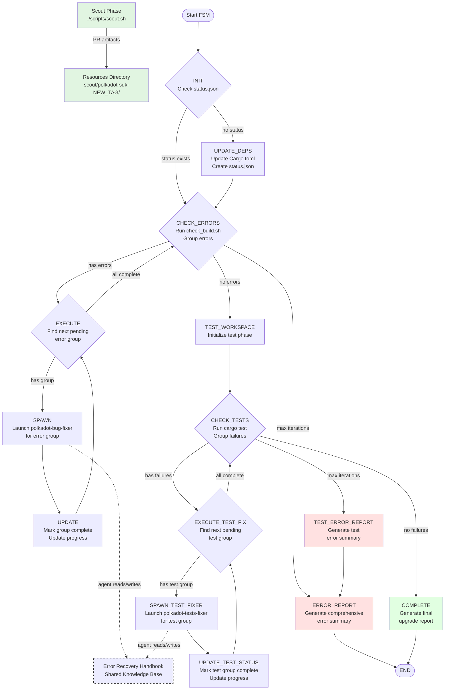

# SDK Upgrader

Automated Polkadot SDK upgrade tool that uses AI agents to handle breaking changes and migration patterns.

## Overview

The SDK Upgrader automates the complex process of upgrading Polkadot SDK dependencies by:
- Analyzing release notes and PR changes
- Applying known migration patterns
- Fixing compilation errors iteratively
- Updating tests to match new APIs

## How It Works



### Key Components

- **Scout**: Downloads PR artifacts and release notes from GitHub
- **Orchestrator**: State machine that manages the upgrade workflow
- **Build Worker (polkadot-bug-fixer)**: Fixes compilation errors by symbol groups
- **Tests Worker (polkadot-tests-fixer)**: Fixes test failures by module
- **Error Groupers**: Python tools that parse and group errors

### Agent Collaboration

The agents collaborate through shared files that enable learning and knowledge transfer:

- **Error Recovery Handbook** (`resources/error_recovery_handbook.md`): 
  - Worker agents append successful fixes to this handbook
  - Subsequent agents check this file first for known solutions
  - Contains a "Fixed Errors Database" that grows with each successful fix
  - Format includes: symbol, error message, fix applied, and SDK version

- **Status File** (`output/status.json`):
  - Central coordination file tracking all error groups and test groups
  - Updated by orchestrator and workers to track progress
  - Prevents duplicate work and enables resumption

- **Upgrade Report** (`output/UPGRADE_REPORT_<NEW_TAG>.md`):
  - Build workers document all fixes applied
  - Includes confidence scores and manual review recommendations
  - Shared knowledge base for the upgrade session

## Quick Start

### Prerequisites

- GitHub CLI (`gh`) authenticated
- Claude CLI installed
- Python 3.x
- jq

### Usage

```bash
# Install agents to your project (optional, for Claude Code users)
make install-agents

# Run complete upgrade process
make run-upgrade OLD_TAG=polkadot-stable2407 NEW_TAG=polkadot-stable2410

# Or run phases separately:
# 1. Gather PR data
./scripts/scout.sh polkadot-stable2410

# 2. Execute upgrade
./scripts/runner.sh polkadot-stable2407 polkadot-stable2410
```

## Directory Structure

```
sdk-upgrader/
├── agents/           # AI agent specifications
├── prompts/          # Orchestrator YAML configurations
├── scripts/          # Scripts and utilities  
├── resources/        # Scout data, handbook, migrations
├── docker/           # Docker environment
└── output/           # Generated reports
```

### Resources Directory

The `resources/` directory contains:

```
resources/
├── error_recovery_handbook.md    # Knowledge base of successful fixes
├── common_migrations.yaml        # Common migration patterns
└── scout/                        # Scout outputs (gitignored)
    └── polkadot-sdk-<NEW_TAG>/
        ├── release-notes.md      # Official release notes
        └── pr-<number>/          # For each PR in the release
            ├── description.md    # PR description and migration notes
            └── patch.diff        # Actual code changes
```

### Output Directory

The upgrade process generates these artifacts in `output/`:

```
output/
├── status.json                      # Real-time progress tracking
├── UPGRADE_REPORT_<NEW_TAG>.md      # Main upgrade report with all fixes
├── test_report_<NEW_TAG>.md         # Test fixing details
├── error_summary_<NEW_TAG>.md       # Summary of unfixed compilation errors
└── test_error_summary_<NEW_TAG>.md  # Summary of unfixed test failures
```

**File Descriptions:**
- **status.json**: Tracks error groups, test groups, iterations, and completion status
- **UPGRADE_REPORT**: Documents all applied fixes, migration patterns, and manual interventions needed
- **test_report**: Details test fixes applied and patterns discovered
- **error_summary**: Generated only if max iterations reached with remaining errors
- **test_error_summary**: Generated only if max iterations reached with failing tests

## Beta Status

This tool is in public beta. Please report issues and contribute improvements!