# 🚀 Polkatron SDK Upgrader MCP Server

**Revolutionary self-contained MCP server** that solves Claude's nested subagent limitation through innovative prompt bundling and main context execution, enabling seamless Polkadot SDK upgrades.

## ✨ Core Innovation: Nested Subagent Problem Solver

### 🧠 The Problem Solved

```mermaid
graph LR
    subgraph "❌ Traditional Approach"
        A[MCP Tool] --> B[Spawns Orchestrator<br/>as SUBAGENT]
        B --> C[❌ Cannot spawn<br/>more subagents]
    end

    subgraph "✅ Polkatron Solution"
        D[MCP Tool] --> E[Returns Expanded Prompt<br/>to Claude]
        E --> F[Claude executes in<br/>MAIN CONTEXT]
        F --> G[✅ Can freely spawn<br/>all subagents]
    end

    style A fill:#ffebee
    style B fill:#ffebee
    style C fill:#ffebee
    style D fill:#e8f5e8
    style E fill:#e8f5e8
    style F fill:#e8f5e8
    style G fill:#e8f5e8
```


### 🎯 Key Benefits
- **No Nested Subagent Limitations**: Orchestrator runs in main context
- **Full Specialization Preserved**: All subagents remain available
- **Minimal Complexity**: ~110 lines + bundled prompt vs complex orchestration
- **Zero Configuration**: No external files or setup required
- **Direct Claude Integration**: Works exclusively with Claude Code CLI
- **Self-Contained**: All prompts, agents, scripts bundled in single package

## 🏗️ System Architecture

```mermaid
graph TB
    subgraph "👤 User"
        USER[Developer with<br/>Polkadot Project]
    end

    subgraph "💻 Claude Code CLI"
        CLI[Claude Code<br/>Main Context]
        MCP_TOOLS[MCP Tools Available<br/>/mcp__sdk-upgrader__*]
    end

    subgraph "🚀 MCP Server Layer"
        MCP[MCP Server<br/>@polkatron/sdk-upgrader-mcp]
        INIT_TOOL[Initialize Tool<br/>Project Setup]
        UPGRADE_TOOL[SDK Upgrade Tool<br/>Prompt Expander]
        BUNDLED[Bundled Assets<br/>• Orchestrator Prompt<br/>• FSM Evaluator Agent<br/>• Bug Fixer Agent<br/>• Test Fixer Agent<br/>• Build Scripts<br/>• Error Grouper]
    end

    subgraph "🔧 Execution Context"
        ORCH_EXEC[Orchestrator Execution<br/>In Main Context]
        FSM_EVAL[FSM Evaluator<br/>State Decisions]
        BUG_FIXER_EXEC[Bug Fixer Agent<br/>Error Resolution]
        TEST_FIXER_EXEC[Test Fixer Agent<br/>Test Resolution]
    end

    subgraph "📁 Project Files"
        CARGO[Cargo.toml<br/>Dependencies]
        STATUS[status.json<br/>FSM State]
        HANDBOOK[Error Recovery<br/>Handbook]
        REPORTS[Generated<br/>Reports]
    end

    USER --> CLI
    CLI --> MCP_TOOLS
    MCP_TOOLS --> MCP

    MCP --> INIT_TOOL
    MCP --> UPGRADE_TOOL

    INIT_TOOL --> BUNDLED
    UPGRADE_TOOL --> BUNDLED

    BUNDLED --> ORCH_EXEC
    ORCH_EXEC --> FSM_EVAL
    FSM_EVAL --> BUG_FIXER_EXEC
    FSM_EVAL --> TEST_FIXER_EXEC

    ORCH_EXEC --> CARGO
    BUG_FIXER_EXEC --> CARGO
    TEST_FIXER_EXEC --> CARGO

    ORCH_EXEC --> STATUS
    FSM_EVAL --> STATUS

    BUG_FIXER_EXEC --> HANDBOOK
    TEST_FIXER_EXEC --> HANDBOOK

    ORCH_EXEC --> REPORTS
    BUG_FIXER_EXEC --> REPORTS
    TEST_FIXER_EXEC --> REPORTS

    style USER fill:#e3f2fd
    style CLI fill:#f3e5f5
    style MCP fill:#fff3e0
    style ORCH_EXEC fill:#e8f5e8
    style CARGO fill:#fff8e1
```



## 🔄 Detailed MCP Server Workflow


## 📊 MCP Server Data Flow


## ⚡ Quick Start

### Prerequisites
- **[Claude Code CLI](https://claude.ai/code)** installed and authenticated
- **Node.js** `>= 18.0.0`
- **GitHub CLI** (`gh`) authenticated (for PR artifact downloads)
- **Python 3.x** (for error grouping)
- **jq** (for JSON processing)

### 1. Install MCP Server
```bash
npm install -g @polkatron/sdk-upgrader-mcp
```

### 2. Register with Claude Code CLI
```bash
claude mcp add --scope user sdk-upgrader stdio://sdk-upgrader-mcp
```

### 3. Verify Installation
```bash
claude mcp list
# Should show: sdk-upgrader
```

### 4. Initialize Your Project (Required!)
```bash
# In your Polkadot project directory, ask Claude:
"Use initialize to set up the required files"
```

### 5. Run SDK Upgrade
```bash
# Now you can upgrade:
"Use sdk_upgrade with oldTag='polkadot-stable2407' and newTag='polkadot-stable2409'"
```

## 🛠️ Development Setup

For development or contributing:

```bash
git clone https://github.com/polkatron/mcp-server
cd mcp-server
bun install
bun run build
claude mcp add --scope user sdk-upgrader stdio://$(pwd)/dist/index.js
```

## 🛠️ Usage

The MCP server exposes two tools as both MCP tools and slash commands:

### Slash Commands (Recommended)
```bash
# Type / in Claude Code to see these commands:
/mcp__sdk-upgrader__initialize    # Initialize project structure
/mcp__sdk-upgrader__sdk_upgrade   # Upgrade SDK (requires oldTag and newTag)
```

### Direct Tool Usage
```bash
# Or use tools directly:
"Use initialize to set up the project"
```

### 1. `initialize` - Setup Required Files (Run First!)

Initializes the project with all required subagent files and directories:

This creates:
- `.claude/agents/` - Subagent definition files (polkadot-bug-fixer.md, polkadot-tests-fixer.md)
- `output/` - FSM state tracking and reports  
- `resources/` - Error recovery handbook and migration patterns
- `scripts/` - Helper scripts (check_build.sh, error_grouper.py)
- `prompts/` - Additional prompt templates

**Important**: This step is mandatory before running sdk_upgrade. The orchestrator needs these subagent files to spawn specialized agents.

### 2. `sdk_upgrade` - Perform the SDK Upgrade

After initialization, upgrade your SDK:

```bash
# In Claude Code:
"Use the sdk_upgrade tool with oldTag='polkadot-stable2407' and newTag='polkadot-stable2409'"
```

Claude will:
1. Call the MCP `sdk_upgrade` tool with the specified parameters
2. Receive the fully expanded orchestrator prompt (with all variables replaced)
3. Execute the orchestrator FSM in the **main agent context**
4. The orchestrator spawns specialized subagents from `.claude/agents/`:
   - `polkadot-bug-fixer` for compilation errors
   - `polkadot-tests-fixer` for test failures

### Tool Parameters

**`initialize`**
- `projectPath` (optional): Project directory (defaults to current directory)

**`sdk_upgrade`**
- `oldTag` (required): Current SDK version (e.g., "polkadot-stable2407")
- `newTag` (required): Target SDK version (e.g., "polkadot-stable2409")  
- `projectPath` (optional): Project directory (defaults to current directory)

## 📦 Bundled Assets Architecture

The MCP server is **completely self-contained** with all required assets bundled:

```mermaid
graph LR
    subgraph "🚀 MCP Server Package"
        CORE[MCP Server Core<br/>• index.ts<br/>• orchestratorTool.ts<br/>• initializeTool.ts]

        BUNDLED_PROMPTS[Bundled Prompts<br/>• Orchestrator FSM Prompt<br/>• FSM Evaluator Agent<br/>• Polkadot Bug Fixer Agent<br/>• Polkadot Test Fixer Agent]

        BUNDLED_SCRIPTS[Bundled Scripts<br/>• scout.sh (PR downloader)<br/>• check_build.sh (error collector)<br/>• check_test_build.sh<br/>• error_grouper.py]

        BUNDLED_RESOURCES[Bundled Resources<br/>• Error Recovery Handbook<br/>• Common Migrations<br/>• Project Templates]
    end

    subgraph "📤 What Gets Created"
        AGENTS_DIR[.claude/agents/<br/>• fsm-evaluator.md<br/>• polkadot-bug-fixer.md<br/>• polkadot-tests-fixer.md]

        SCRIPTS_DIR[scripts/<br/>• scout.sh<br/>• check_build.sh<br/>• check_test_build.sh<br/>• error_grouper.py]

        RESOURCES_DIR[resources/<br/>• error_recovery_handbook.md<br/>• common_migrations.yaml<br/>• scout/ (for PR artifacts)]

        OUTPUT_DIR[output/<br/>• status.json (FSM state)<br/>• UPGRADE_REPORT_*.md<br/>• test_report_*.md]
    end

    CORE --> AGENTS_DIR
    BUNDLED_PROMPTS --> AGENTS_DIR
    BUNDLED_SCRIPTS --> SCRIPTS_DIR
    BUNDLED_RESOURCES --> RESOURCES_DIR
    CORE --> OUTPUT_DIR

    style CORE fill:#e3f2fd
    style BUNDLED_PROMPTS fill:#f3e5f5
    style AGENTS_DIR fill:#e8f5e8
    style RESOURCES_DIR fill:#fff8e1
```

### 🎯 Zero Configuration Principle
- **No external files required** - Everything bundled in the MCP server
- **No manual setup** - Project initialization creates all necessary files
- **No API dependencies** - Works exclusively with Claude Code CLI
- **No complex configuration** - Variables expanded automatically

## 📖 Technical Implementation: How It Works

### Phase 1: Project Initialization


### Phase 2: SDK Upgrade Execution


### 🔧 Step Execution Types
The orchestrator executes different types of steps returned by the FSM evaluator:

| Step Type | Purpose | Example |
|-----------|---------|---------|
| **bash** | Execute shell commands | `{"type": "bash", "command": "cargo check", "output_var": "build_result"}` |
| **spawn_agent** | Launch specialized agents | `{"type": "spawn_agent", "agent": "polkadot-bug-fixer", "context": {...}}` |
| **update_status** | Modify status.json | `{"type": "update_status", "field": "iteration", "value": "{{iteration + 1}}"}` |
| **parse** | Run data parsers | `{"type": "parse", "parser": "error_grouper", "input": "...", "output_var": "..."}` |
| **check_file** | Verify file existence | `{"type": "check_file", "path": "...", "exists_var": "..."}` |

This avoids the nested subagent limitation since the orchestrator runs in Claude's main context and can access pre-installed subagent files.

## 🔧 Configuration

### Environment Variables
```bash
# Optional: Logging level
LOG_LEVEL=info
```

## 🧪 Testing

```bash
# For development
bun test
bun run build

# Test with Claude Code (after npm install -g)
claude "First use initialize, then use sdk_upgrade to upgrade from polkadot-stable2407 to polkadot-stable2409"
```

## 🛡️ Security Features

- **Variable expansion** - Safe replacement of environment variables
- **Path resolution** - Secure path handling for generated paths
- **Input validation** - Required parameters are checked
- **No command execution** - Server only returns prompts, doesn't execute commands

## 🔍 Troubleshooting Guide

### 🚨 Common Issues & Solutions

#### Issue: MCP Tool Not Appearing in Claude
**Symptoms:** `/mcp__sdk-upgrader__*` commands not available
**Solutions:**
```bash
# 1. Re-register the MCP server
claude mcp remove sdk-upgrader
claude mcp add --scope user sdk-upgrader stdio://$(pwd)/dist/index.js

# 2. Verify installation
claude mcp list
# Should show: sdk-upgrader

# 3. Restart Claude Code CLI
# Close and reopen your terminal/claude session
```

#### Issue: "Subagent not found" Errors
**Symptoms:** Orchestrator fails to spawn fsm-evaluator or other agents
**Root Cause:** Missing subagent files in `.claude/agents/`
**Solution:**
```bash
# Always run initialize first
# In Claude: "Use initialize to set up the project"

# Verify subagent files exist
ls -la .claude/agents/
# Should contain:
# - fsm-evaluator.md
# - polkadot-bug-fixer.md
# - polkadot-tests-fixer.md
```

#### Issue: Orchestrator Not Executing Properly
**Symptoms:** SDK upgrade starts but fails early or gets stuck
**Diagnostic Steps:**
```bash
# 1. Verify project structure
ls -la scripts/
# Should contain: scout.sh, check_build.sh, check_test_build.sh, error_grouper.py

ls -la output/
# Should contain: status.json

ls -la resources/
# Should contain: error_recovery_handbook.md, common_migrations.yaml

# 2. Check status.json is valid
cat output/status.json | jq .
# Should be valid JSON with current_state and other fields

# 3. Verify Claude can access the project directory
pwd
# Should be the project root directory
```

#### Issue: Build Errors Not Being Fixed
**Symptoms:** cargo check still fails after agent execution
**Possible Causes:**
- **Missing dependencies:** Run `cargo update` manually
- **Complex interdependent errors:** May require manual intervention
- **Agent confidence threshold:** Some fixes may need manual review
- **SDK version mismatch:** Verify oldTag/newTag are correct

**Debug Steps:**
```bash
# 1. Check current build status manually
./scripts/check_build.sh

# 2. Review error recovery handbook
cat resources/error_recovery_handbook.md
# Check if similar errors have known fixes

# 3. Verify scout artifacts were downloaded
ls -la resources/scout/polkadot-sdk-*
# Should contain PR description and patch files
```

#### Issue: Test Failures Not Being Fixed
**Symptoms:** cargo test still fails after test agent execution
**Debug Steps:**
```bash
# 1. Check test status manually
./scripts/check_test_build.sh

# 2. Review test error patterns
cat output/test_error_summary_*.md 2>/dev/null || echo "No test error summary found"

# 3. Check test phase in status
jq '.test_phase' output/status.json
```

### 🔧 Advanced Troubleshooting

#### Manual FSM State Recovery
If the orchestrator gets stuck in a bad state:
```bash
# 1. Backup current status
cp output/status.json output/status.json.backup

# 2. Reset to known good state
cat > output/status.json << 'EOF'
{
  "current_state": "INIT",
  "pending_steps": [],
  "execution_context": {
    "variables": {},
    "last_error": null
  },
  "error_groups": [],
  "iteration": 0,
  "projectPath": "$(pwd)"
}
EOF

# 3. Restart the upgrade process
# In Claude: "Use sdk_upgrade with oldTag=X newTag=Y"
```

#### Network Issues with Scout
If PR artifact downloads fail:
```bash
# 1. Check GitHub CLI authentication
gh auth status

# 2. Test manual PR access
gh pr view 12345 --repo paritytech/polkadot-sdk

# 3. Run scout manually
./scripts/scout.sh polkadot-stable2409

# 4. Check scout directory
ls -la resources/scout/polkadot-sdk-*
```

#### Performance Issues
**Symptoms:** Upgrade process is slow or hangs
**Optimizations:**
- **Reduce max iterations:** Lower `$MAX_ITERATIONS` in status.json
- **Focus on specific errors:** Comment out unrelated parts of Cargo.toml
- **Manual intervention:** Fix obvious errors manually before running agents
- **Parallel processing:** The current design is sequential for safety

### 📞 Getting Help

1. **Check the error recovery handbook** - Many common issues have documented solutions
2. **Review generated reports** - `output/UPGRADE_REPORT_*.md` contains detailed logs
3. **Examine status.json** - Shows exactly where the process is stuck
4. **Test individual components** - Run scripts manually to isolate issues

### 🐛 Reporting Issues

When reporting problems, please include:
- **Claude Code CLI version:** `claude --version`
- **MCP server version:** Check `package.json`
- **Current status.json:** `cat output/status.json`
- **Error logs:** Any stderr output from the process
- **Project structure:** `find . -name "*.toml" -o -name "*.rs" | head -20`
- **SDK versions:** oldTag and newTag used

### ⚡ Quick Recovery Commands

```bash
# Complete reset (use with caution)
rm -rf .claude/agents/ output/ resources/scout/
# Then re-run: "Use initialize to set up the project"

# Soft reset (preserves handbook knowledge)
rm output/status.json
# Then re-run: "Use sdk_upgrade with oldTag=X newTag=Y"

# Clean re-run with existing setup
# Just run: "Use sdk_upgrade with oldTag=X newTag=Y"
```

## 📊 Architecture Benefits

- **No nested subagents** - Orchestrator runs in main context
- **Full specialization preserved** - All subagents remain available
- **Minimal complexity** - ~110 lines of code + bundled prompt
- **Zero configuration** - No external files needed
- **Direct prompt execution** - Claude handles orchestration natively
- **No API dependencies** - Works with Claude Code CLI only

## 🚧 The Nested Subagent Problem: Deep Technical Analysis

### 🔍 Understanding the Core Limitation
Claude Code CLI has a fundamental architectural constraint:

```mermaid
graph TD
    subgraph "❌ Claude's Subagent Limitation"
        MAIN[Claude Main Context<br/>✅ Can spawn subagents]
        SUB1[Subagent Level 1<br/>❌ Cannot spawn subagents]
        SUB2[Subagent Level 2<br/>❌ Blocked by architecture]
    end

    subgraph "🔄 Traditional MCP Approach (Broken)"
        MCP_TOOL[MCP Tool Call]
        ORCH_SUB[Orchestrator as Subagent<br/>❌ Cannot spawn more subagents]
        SPECIALIZED[Specialized Agents<br/>❌ Unreachable]
    end

    MAIN --> SUB1
    SUB1 -.->|❌ Blocked| SUB2
    MCP_TOOL --> ORCH_SUB
    ORCH_SUB -.->|❌ Cannot reach| SPECIALIZED

    style SUB1 fill:#ffebee
    style SUB2 fill:#ffebee
    style ORCH_SUB fill:#ffebee
    style SPECIALIZED fill:#ffebee
```



### 🧠 Revolutionary Solution: Prompt Bundling

```mermaid
graph TD
    subgraph "✅ Polkatron's MCP Innovation"
        MCP_SERVER[MCP Server<br/>Returns expanded prompt]
        MAIN_CTX[Claude Main Context<br/>✅ Executes orchestrator]
        FSM_EVAL[FSM Evaluator Subagent<br/>✅ Can spawn specialized agents]
        BUG_FIXER[Bug Fixer Subagent<br/>✅ Works normally]
        TEST_FIXER[Test Fixer Subagent<br/>✅ Works normally]
    end

    subgraph "📦 Bundled Assets"
        ORCH_PROMPT[Bundled Orchestrator Prompt<br/>Complete FSM workflow]
        AGENT_PROMPTS[Bundled Agent Definitions<br/>fsm-evaluator, bug-fixer, test-fixer]
        SCRIPTS[Bundled Scripts & Tools<br/>scout.sh, error_grouper.py, etc.]
    end

    MCP_SERVER --> MAIN_CTX
    ORCH_PROMPT --> MAIN_CTX
    MAIN_CTX --> FSM_EVAL
    FSM_EVAL --> BUG_FIXER
    FSM_EVAL --> TEST_FIXER

    style MAIN_CTX fill:#e8f5e8
    style FSM_EVAL fill:#e8f5e8
    style BUG_FIXER fill:#e8f5e8
    style TEST_FIXER fill:#e8f5e8
```



### 🎯 Key Innovation: Context Preservation
1. **MCP Server** expands variables and returns the complete orchestrator prompt
2. **Claude executes** the orchestrator in its main context (not as a subagent)
3. **Orchestrator spawns** FSM evaluator for state decisions
4. **FSM evaluator spawns** specialized agents for actual work
5. **All agents** operate normally within Claude's architecture

### 📊 Architectural Benefits Comparison

| Aspect | Traditional Approach | Polkatron Solution |
|--------|---------------------|-------------------|
| **Subagent Depth** | ❌ Limited to 1 level | ✅ Full depth support |
| **Orchestrator Context** | ❌ Lost in subagent | ✅ Main context execution |
| **Agent Specialization** | ⚠️ Limited by nesting | ✅ All agents available |
| **State Management** | ⚠️ Complex workarounds | ✅ Native Claude context |
| **Error Recovery** | ⚠️ Context switching issues | ✅ Seamless error handling |
| **Scalability** | ❌ Architecture bound | ✅ Claude's full capabilities |

## 🔄 What the Orchestrator Does

When Claude receives the expanded orchestrator prompt from the MCP tool, it executes a complete FSM workflow in its main context:

### **Core Execution Loop**


### **State Management & Progress Tracking**
- **Real-time status updates** in `status.json` FSM state file
- **Progress transparency** with detailed logging and reports
- **Error recovery** with context preservation across iterations
- **Deterministic state transitions** based on completion conditions

### **Agent Orchestration**
- **FSM Evaluator**: Makes state transition decisions based on status
- **Bug Fixer Agent**: Handles compilation errors by symbol groups
- **Test Fixer Agent**: Processes test failures by module
- **Knowledge Transfer**: All agents update shared error recovery handbook

This architecture enables the orchestrator to leverage Claude's full capabilities while maintaining clean separation between decision-making (FSM evaluator) and execution (main context).

## 📝 Development

### Project Structure
```
mcp-server/
├── src/
│   ├── index.ts              # MCP server entry point
│   ├── orchestratorTool.ts   # Prompt expander and config builder
│   └── initializeTool.ts     # Project initialization with subagents
├── tests/
│   └── orchestrator.test.ts  # Unit tests
├── dist/                     # Compiled JavaScript
├── package.json             # Dependencies
└── README.md               # This file
```

### Key Components
- **Bundled Prompt**: Complete orchestrator FSM workflow embedded in the code
- **Bundled Subagents**: polkadot-bug-fixer and polkadot-tests-fixer agents included
- **Variable Expansion**: Replaces $VAR and ${VAR} patterns with actual values
- **Path Generation**: Builds all required paths for the upgrade process
- **Project Initialization**: Creates all required files and directories for operation
- **MCP Prompts**: Exposes tools as native slash commands through prompts capability

## 📄 License

MIT License - see LICENSE file for details.

---

**🎯 Fully self-contained - no external files or configuration needed!**

The orchestrator runs in Claude's main context and can freely spawn all specialized subagents!